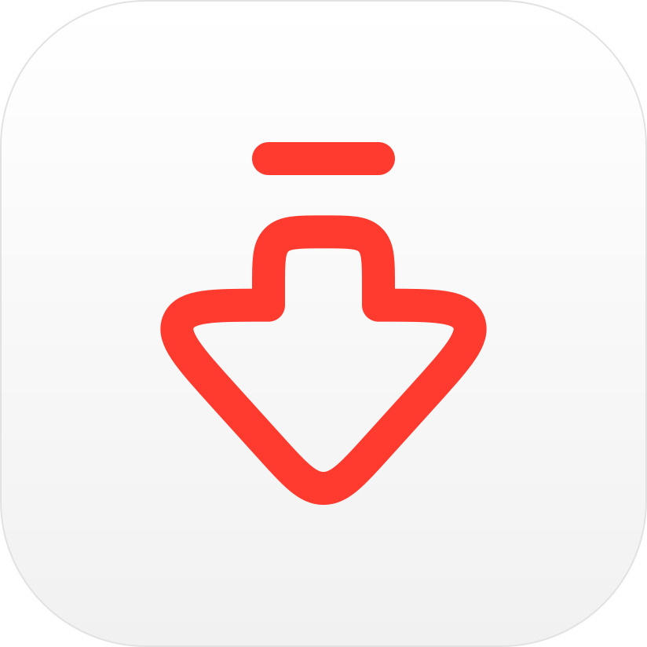

# youtube-downloader

A native Mac app: paste a YouTube link, pick a quality, optionally cut a part,
get the file in `~/Downloads`. Built on `yt-dlp` and `ffmpeg`.

Quality options:
- **Max:** mkv, up to 4K. Plays in VLC or IINA, not QuickTime.
- **Compatible:** mp4, up to 1080p. Plays anywhere.
- **Audio:** mp3.

## Build

```sh
sh mac/build.sh   # -> mac/build/youtube-downloader.dmg
```

Needs Xcode command line tools. Apple Silicon, macOS 26+. yt-dlp, ffmpeg and
node are downloaded and bundled into the app, so users need nothing installed.

On another Mac, allow the app once in System Settings → Privacy & Security →
Open Anyway (it is not notarized).

## Releases and updates

Push a tag to build the DMG on GitHub Actions and publish it as a release:

```sh
git tag v1.1.0 && git push origin v1.1.0
```

The app checks the latest release on launch. When it is newer, an "Update"
button appears; it downloads the DMG, replaces the app and relaunches it.

## Notes

- If downloads start failing with `HTTP Error 403`, yt-dlp is out of date.
  Publish a new release: CI always bundles the latest yt-dlp.
- Downloading videos you do not own may breach YouTube's Terms of Service.
